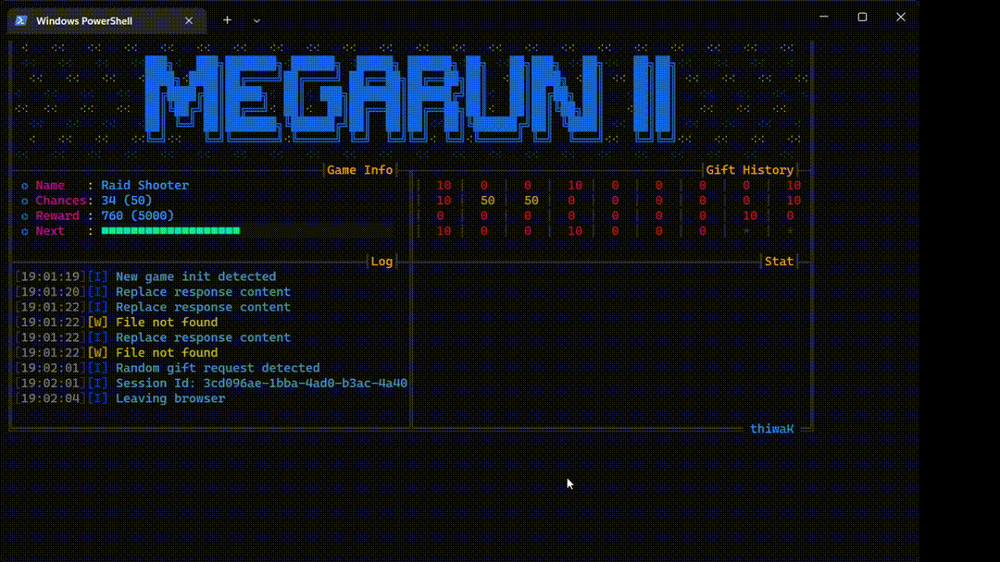

# 🌌 MegaRun-II

> "I’ll keep this lit for the comfort of those searching for a way out of the darkness."

A Python-based client for _Mega Games_ within the WOW Android app, reverse-engineered for educational purposes, focusing on automation.



---
### 🟥 NOTE

**Please do not contact me personally regarding issues or questions related to this repository.**

**කරුණාකර මෙම රිපෝවට අදාල ගැටළු සම්බන්ධයෙන් මා පුද්ගලිකව සම්බන්ධ කරගැනීමෙන් වලකින්න**

---
### ⚠️ DISCLAIMER

Please note that this app is provided **WITHOUT WARRANTY OR SUPPORT**. Use this software **AT YOUR OWN RISK**. I assume **NO RESPONSIBILITY** for any issues that may arise from its use, including potential account suspension or bans.  **PROCEED WITH CAUTION** and be sure you understand the risks before using this client app.

This app was developed for fun and educational purposes. **DO NOT** use it for any **illegal activities** or in **violation of any terms of service**. I am **NOT RESPONSIBLE** for any of your actions or consequences arising from the use of this app.

---
### ✨ Story

The first version of `MegaRun` was developed using the `Unity` game engine, where the scripting language of choice was `C#`. The app relied on the `Assembly-CSharp.dll` file for its core logic. Despite its obfuscated function names filled with random "A"s, moders found it relatively easy to manipulate. They took advantage of this simplicity, modifying the original app to unlock various _"abilities"_. However, these modified versions quickly spread, leading to unintended consequences. The app was terminated due to the widespread misuse of these mods, marking an abrupt end to the original `MegaRun`.

Later, _"the app owner"_ decided to give a second chance to its authentic users. But this time with enhanced security measures. The new version, known as `WOW`, was developed in `React Native` with the `Hermes` engine, making it considerably harder to reverse engineer. This updated framework presented significant obstacles for those who attempted to modify it. But as with any challenge, those with enough creativity and persistence would inevitably find ways to push the boundaries.

I began this project for fun and educational purposes. However, as I delved deeper, I found that achieving my desired results became increasingly difficult. Weeks passed without clear direction, but the more challenging it became, the more obsessed I grew with finding a solution. Despite the frustration, each setback fuelled my determination to explore, to test, and to break through barriers that seemed unbreakable. The journey itself became the reward, a relentless pursuit of understanding and mastery.

I published this repository to offer some comfort to those on similar journeys, grappling with the same obstacles. If you possess the strength, skills, and determination, you’ll uncover the missing pieces of this puzzle on your own. I won’t be providing hints or guidance, as I fear this app could meet the same fate as its predecessor. _The journey may be challenging, but for those willing to persist, the answers await_.

---
### ⚙️ Getting Started
1. **Clone the Repository**: 
```bash
   git clone https://github.com/thiwaK/MegaRun-II.git
   ```
2. **Install Dependencies**:
```bash
   pip install -r requirements.txt
   ```
3. **Run the Client**:
```bash
   python main.py
   ```
---
### 🔧 Usage

```bash
  python main.py [OPTIONS]
```

| Option               | Description                                                                |
| -------------------- | -------------------------------------------------------------------------- |
| `--config`,`-c`      | Specify the path to the configuration file. Defaults to `config.js`        |
| `--secondary-config`,`-c2` | Load a secondary configuration file, overriding the primary configuration. |
| `--update-token`     | Refresh or regenerate the client’s authentication token.                   |
| `--skip-warn`     | Continue execution despite warnings.                                       |
| `--browser-mode` | Allow gameplay to continue in the browser.                                 |
| `--ignore-chance-limit` | Prevent the app from auto-terminating when chances are over.               |
| `--minimal-ui` | Minimal UI mode.               |

---
### 🚀 Contribution
Contributions are welcome! Feel free to open issues, submit PRs, or suggest improvements to make this resource more valuable to explorers alike.

---
### 🙏 Acknowledgements

This project is the result of countless hours of exploration and research in reverse engineering and coding.

Special thanks to the creators and maintainers of the following tools, which were invaluable in this journey:

- [hbctool](https://github.com/cyfinoid/hbctool): A command-line interface for disassembling and assembling the Hermes Bytecode.

- [hermes-dec](https://github.com/P1sec/hermes-dec): A reverse-engineering tool for disassembling and decompiling React Native files compiled into the Hermes VM bytecode (HBC) format.

- [Esprima](https://github.com/jquery/esprima): A high performance, standard-compliant ECMAScript parser.

- [mitmproxy](https://github.com/mitmproxy/mitmproxy): An interactive, SSL/TLS-capable intercepting proxy with a console interface for HTTP/1, HTTP/2, and WebSockets.

<!-- - [Frida](https://github.com/frida/frida): Dynamic instrumentation toolkit for developers, reverse-engineers, and security researchers. -->


To all the developers, researchers, and enthusiasts in the reverse-engineering community who share their tools, insights, and experiences: your work continues to inspire and pave the way for others to learn and grow.

Thank you for being part of this journey!